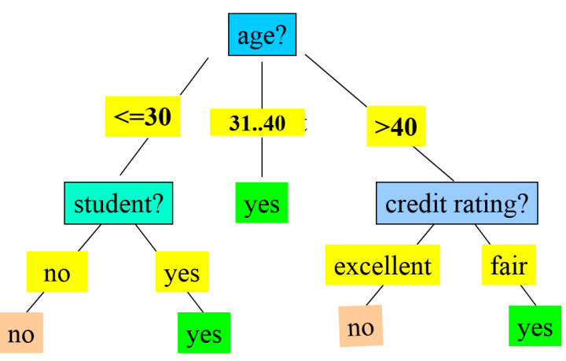

# Decision Tree (ID3) Algorithm
- Super Easy Usage!
- The decision tree algorithm is a popular machine learning technique used for classification and regression analysis. It involves recursively partitioning the data based on the features to create a tree-like model of decisions and their possible consequences. The algorithm begins by selecting the most significant feature in the dataset and splitting the data based on this feature. The process is repeated for each subset of data, resulting in a tree-like structure where each internal node represents a decision based on a feature, and each leaf node represents the outcome of that decision. The tree is pruned to remove unnecessary branches, and the resulting model is used for prediction or classification of new data. The decision tree algorithm is easy to interpret and provides insight into the decision-making process, making it a valuable tool in various fields such as healthcare, finance, and engineering.

Step 1. Add it in your root ``build.gradle.kts`` at the end of repositories:
````kotlin
repositories {
    ...
    maven(uri("https://jitpack.io"))
}
````

Step 2. Add the dependency:

````kotlin
implementation("com.github.fcenesiz:decision-tree:1.1.0")
````


### Example Usage

````kotlin
fun main() {

    val targetKey = "buys_computer"
    val decisionTree = DecisionTree()

    // create the tree
    decisionTree.create(dataset, targetKey)
    // show created tree
    decisionTree.show()

    // prune tree
    decisionTree.pruning()
    // show pruned tree
    decisionTree.show()

    // classify
    val result = decisionTree.classify(mutableMapOf(
        "age" to "<=30",
        "income" to "high",
        "student" to "no",
        "credit_rating" to "fair")
    )
    println("result: $result")
    
}
````
### output: ``result: no``

### pruned tree:
````
-+ root: age
    -+ <=30: student
                -> no: no
                -> yes: yes
    -> 31..40: yes
    -+ >40: credit_rating
                -> fair: yes
                -> excellent: no
````



### dataset:

````kotlin
private val age = mutableListOf("<=30", "<=30", "31..40", ">40", ">40", ">40", "31..40", "<=30", "<=30", ">40", "<=30", "31..40", "31..40", ">40")
private val income = mutableListOf("high", "high", "high", "medium", "low", "low", "low", "medium", "low", "medium", "medium", "medium", "high", "medium")
private val student = mutableListOf("no", "no", "no", "no", "yes", "yes", "yes", "no", "yes", "yes", "yes", "no", "yes", "no")
private val credit_rating = mutableListOf("fair", "excellent", "fair", "fair", "fair", "excellent", "excellent", "fair", "fair", "fair", "excellent", "excellent", "fair", "excellent")
private val buys_computer = mutableListOf("no", "no", "yes", "yes", "yes", "no", "yes", "no", "yes", "yes", "yes", "yes", "yes", "no")

private val dataset : MutableMap<String, MutableList<String>> = mutableMapOf(
    "age" to age,
    "income" to income,
    "student" to student,
    "credit_rating" to credit_rating,
    "buys_computer" to buys_computer
)
````